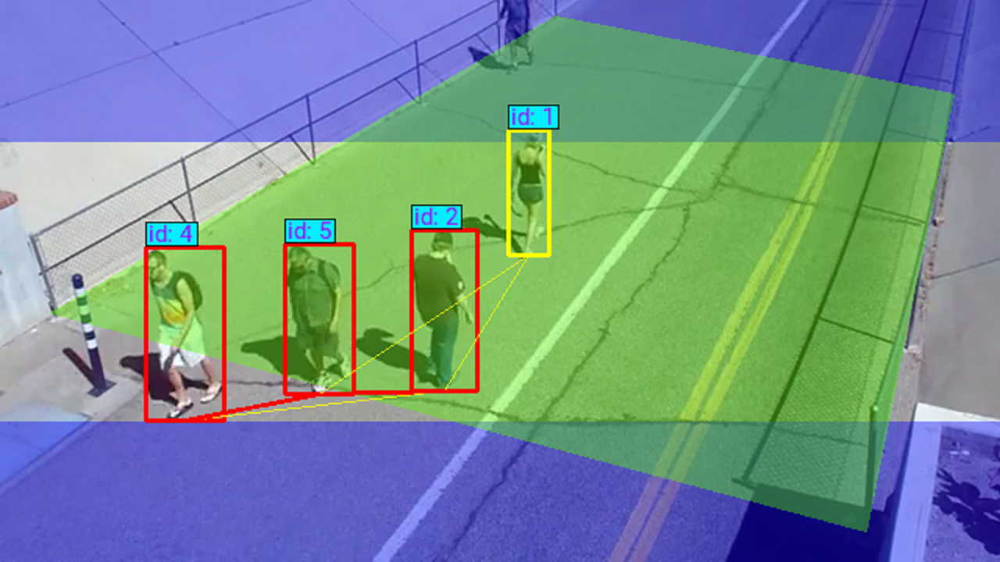

# Volteo Safe WorkSpace Modules

The Volteo Safe WorkSpace IoT Modules can ensure compliance with pandemic safety guidelines by providing social distancing detection and mask detection that report potential violations to an administrative hub.


## Mask Detection COnfiguration
- Download Volteo Mask Detection Module from Azure Marketplace and deploy to your edge
- Signup and get the license key
- Replace the license key in environment variable **LICENSE_KEY**
- Redeploy the module
- Here is the postman docs to quickly try it out on a single image - https://documenter.getpostman.com/view/1329930/TVzLpLZZ

## Social Distancing Configuration

### Environment Variables Reference
The module has two modes for estimating distance between detected people and whether they are in violation of social distancing, with user-set environment variables influencing which one is chosen and how it is performed. The Bird Eye mode is recommended as it can offer better precision on distance measurement, but requires some additional information from the user to be used.

**Note: All pixel-oriented environment variable values should be adjusted for the resized images dimensions provided by IMAGE_HEIGHT and IMAGE_WIDTH** (REGION_MASK_COORDS, RECT_COORDS, PIXEL_HORIZONTAL_THRESH, PIXEL_VERTICAL_THRESH)

#### Environment Variables applicable to both modes
##### Required
- LICENSE_KEY - A valid license key is necessary to run the module. The license is validated when starting the module and periodically thereafter. If the license is found to not exist or have expired, then the module will return empty detection results noting that the license is inalid.
- CAMERA_ID - This is a user-chosen string for device name that is included in detection response bodies from the module
- DEVICE_NAME - This is a user-chosen string for device name that is included in detection response bodies from the module

##### Optional
- IMAGE_HEIGHT (default: 360) - The height to resize a given input frame to.
- IMAGE_HEIGHT (default: 640) - The width to resize a given input frame to.
- BIRD_EYE (default: false) - This environmental variable denotes which mode is chosen. If set to true, bird eye mode is enabled and additional environment variables are expected to provide information on how to transform the image coordinates to that of a bird's eye view of the image.
- REGION_MASK_COORDS (default: "") - A set(s) of points denoting a polygon(s) overlayed on a given image to ignore detected perrsons found within, provided in the form `[ (p1_x1, p1_y1), (p1_x2, p1_y2), (p1_x3, p1_y3), ... (p1_xn, p1_yn) ], [ (p2_x1, p2_y1), (p2_x2, p2_y2), (p2_x3, p2_y3), ... (p2_xn, p2_yn) ], ... [ (pn_x1, pn_y2), ... (pn_xn, pn_yn) ]`. Basically, this environment variable records regions of the image to ignore by accepting an arbitrary set of polygons with an arbitrary amount of points. The points must be provided in a contiguous order such that any given point should connect with the next point in the sequence, with the last point implicitly looping back to the first point listed. For example, if the provided string was `[(0, 0), (0, 180), (90, 180), (90, 0)], [(270, 0), (270, 180), (360, 180), (360, 0)]`, it would create two rectangular regions, each of height 90 and width 180, towards the lefthand side of the image to be ignore detections within.
- YOLO_MODEL (default: yolov5m.pt) - This module uses a version of the YOLOv5 object detection model for detecting persons and this environment variable can adjust which specific model is used. The available options to set it, in order of ascending size, as are as follows: yolov5s.pt, yolov5m.pt, yolov5l.pt, yolov5x.pt. Larger models can provide better accuracy, but come at a cost of increased time to process a given image.
- CONFIDENCE_THRESHOLD (default: 0.5) - The minimum confidence level to count a given person detection can be optionally set
- NMS_THRESHOLD (default: 0.5) - The threshold hyperparameter for nonmaximum suppression can be optionally set 

#### REQUIRED Environment Variables if BIRD_EYE is true
In order to use Bird Eye mode, the module requires a set of four points that map to a flat rectangle on the ground in the real world and the real world dimensions of the rectangle.
- RECT_COORDS - four coordinates provided in the form `[(x1, y1), (x2, y2), (x3, y3), (x4, y4)]`. For example, if the provided coordinates were `[(92, 260), (225, 335), (331, 144), (450, 183)]`, it would designate the calibration quadrilateral as having those points when transforming the image coordinates accordingly
- RECT_FEET_WIDTH - Integer amount of real-world feet that the points represent in width
- RECT_FEET_HEIGHT - Integer amount of real-world feet that the points represent in height


#### OPTIONAL Environment Variables if BIRD_EYE is false
When Bird Eye mode is not enabled, the module defaults to estimating thresholds based on pixel distance between bounding box centers of detected people. This mode is not recommended but it can roughly function if you do not have the adequate information for bird-eye view.
- PIXEL_HORIZONTAL_THRESHOLD (default: 50) - Horizontal pixel limit under which detections considered to be in violation of social distancing if also under the vertical limit
- PIXEL_VERTICAL_THRESHOLD (default: 50) - Vertical pixel limit under which detections considered to be in violation of social distancing if also under the horizontal limit


## Module Integration with Azure Live Video Analytics(LVA)

### Example Media Graph for MAsk Detection

Setup and Quick Start [LVA Setup](https://docs.microsoft.com/en-us/azure/media-services/live-video-analytics-edge/get-started-detect-motion-emit-events-quickstart)

Clone this repo [Cloud device console app](https://github.com/Azure-Samples/live-video-analytics-iot-edge-python-sdk/tree/main/src/cloud-to-device-console-app) and configure IoT Edge hub settings from README


Copy mask-detection-lva/* files to above repo

Validate RTSP Stream End points in both operations.json and topology.json in [repo](./mask-detection-lva/topology.json)

Activate LVA Graph by running  **python main.py**

Once graph is activated, mask detection violation events should be flowing to Azure IoT Hub

### Example Media Graph for Social Distancing
In the topology of the Azure Media Graph, the Social Distancing Detection module should be integrated as an HTTP extension that runs as an image on the edge device's port 7500 (i.e. http://localhost:7500 on the edge device).

A sample topology is provided in [social-distancing/topology.json](./social-distancing/topology.json); which connects an RTSP stream to a frame filter that feeds frames to the Social Distancing Module, and from there the Module sends its inference results to an IoT Hub.

### IoT Hub Events

The Social Distancing Detection Module can be integrated in an Azure Media Graph to send information about processed image frames to an IoT Hub. The following is information provided from an inference of an image frame by the module:
```
{
	licenseValid: boolean, // true if the provided license key exists and is active, false otherwise. If false, a result denoting no detections is returned
	imageId: string, // randomly generated letter sequence associated with image
	peopleCount: int, // number of detected people
	violations: int, // number of detected social distancing violations
	type: "social-distancing",
	people: [ //list of objects denoting information about each detected person
	{ 
	  boundingBox: list, // bounding box coordinates in the form [x_start, y_start, x_end, y_end]
	  isViolating, boolean // whether the person is violating social distancing,
	  isWarning: boolean // whether the person is close to, but not yet, violating social distancing
	},
	...
	...
	],

}
```